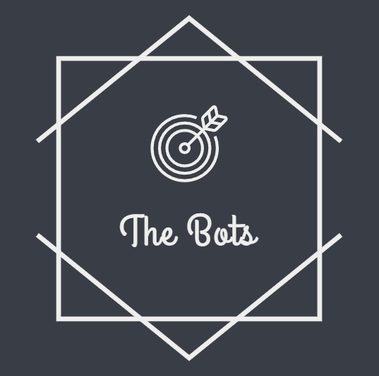

<h1 align="center"> The Bots </h1>
 

 

 

## Topic
A site related to Robotics.

## Used technologies

-  git  
-  CSS 3  
-  HTML 5  
-  Microsoft PowerPoint  
-  Microsoft Teams  
-  GitHub  

## Our Team
- <a href="https://github.com/MMShavov22"> Martin Shavov (Scrum Trainer)</a>  
   
- <a href="https://github.com/VNMihaylov22"> Velizar Mihaylov (Designer) </a> 
   
- <a href="https://github.com/KKIvanov22"> Kaloyan Ivanov (Frontend developer) </a> 
  
- <a href="https://github.com/DKrKostadinov22"> Daniel Kostadinov (Frontend developer) </a> 
